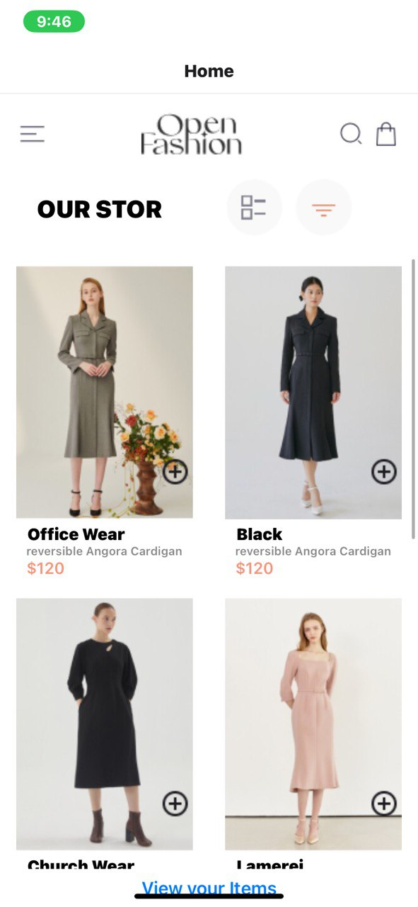
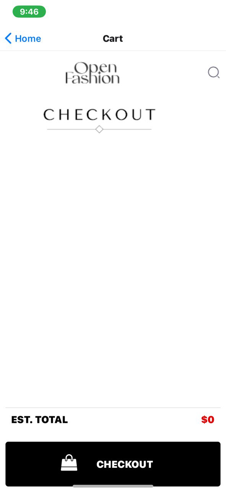
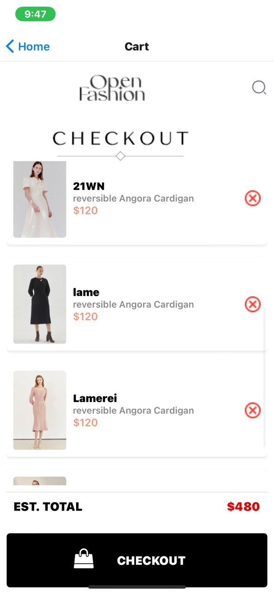

# OVERVIEW

This project is a React Native shopping application. The application features a home screen and a cart screen, and it uses React Navigation to handle navigation between these screens. The app also includes various assets such as images and icons.

# App.js

The App.js file serves as the entry point of the application. It sets up the navigation container and the stack navigator to manage the screens.

# COMPONENTS

## NAVIGATIONCONTAINER

 Manages the navigation tree and the navigation state.

## CREATESTACKNAVIGATOR

Creates a stack navigator to handle screen transitions.

## HOMESCREEN

Component for the Home screen, located in ./Screens/HomeScreen.js.

## CARTSCREEN

Component for the Cart screen, located in ./Screens/CartScreen.js.

## INITIAL ROUTE

The initial route of the stack navigator is set to "Home".

# SCREENS

## HOMESCREEN

The HomeScreen component is located in ./Screens/HomeScreen.js. It serves as the main landing page of the application.

## CARTSCREEN

The CartScreen component is located in ./Screens/CartScreen.js. It displays the items in the user's cart.

# ASSETS

The assets directory contains various image files used in the application, such as icons and splash screens.

# SCREENSHOTS

## HOME SCREEN

## CHECKOUT SCREEN

## CHECKOUT MENU

